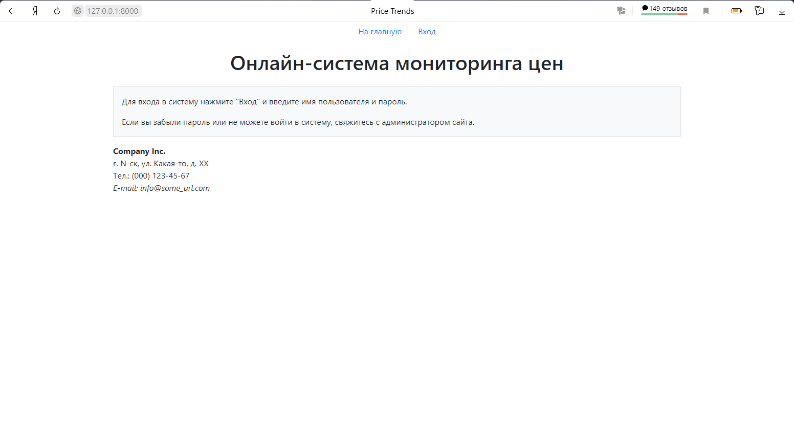
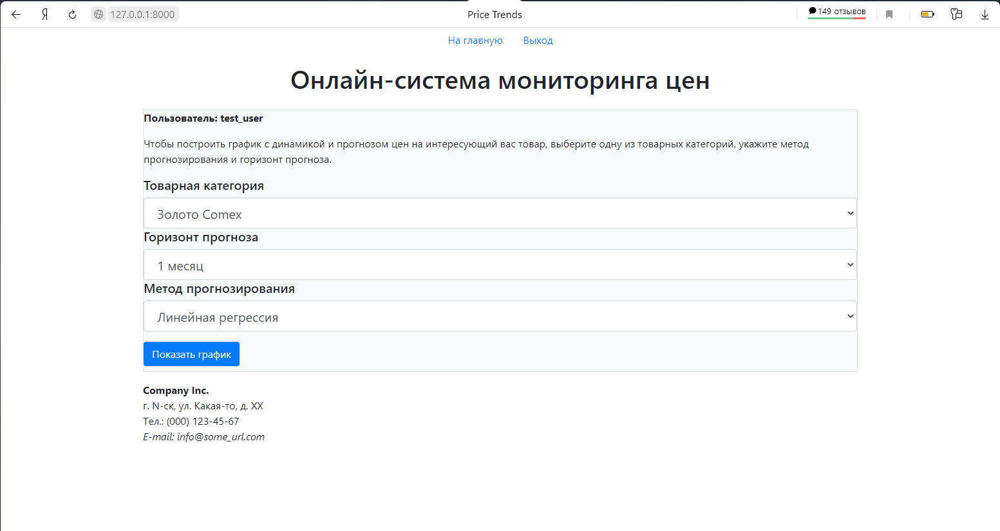
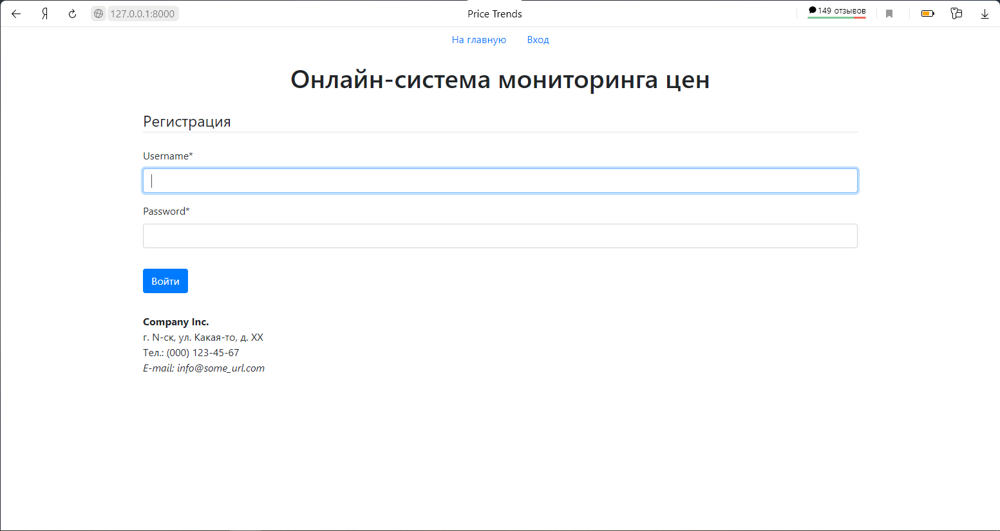
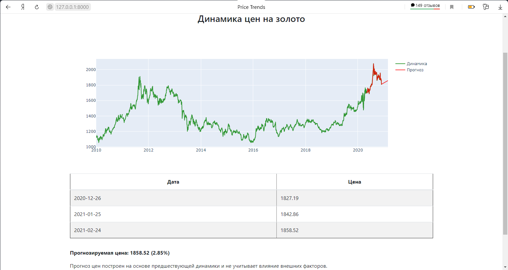
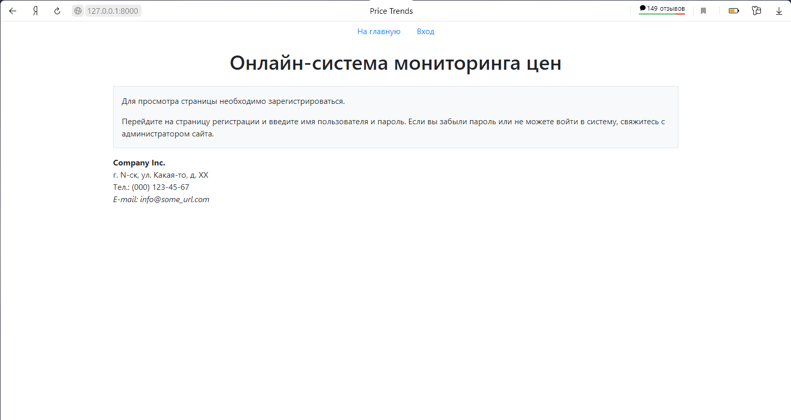
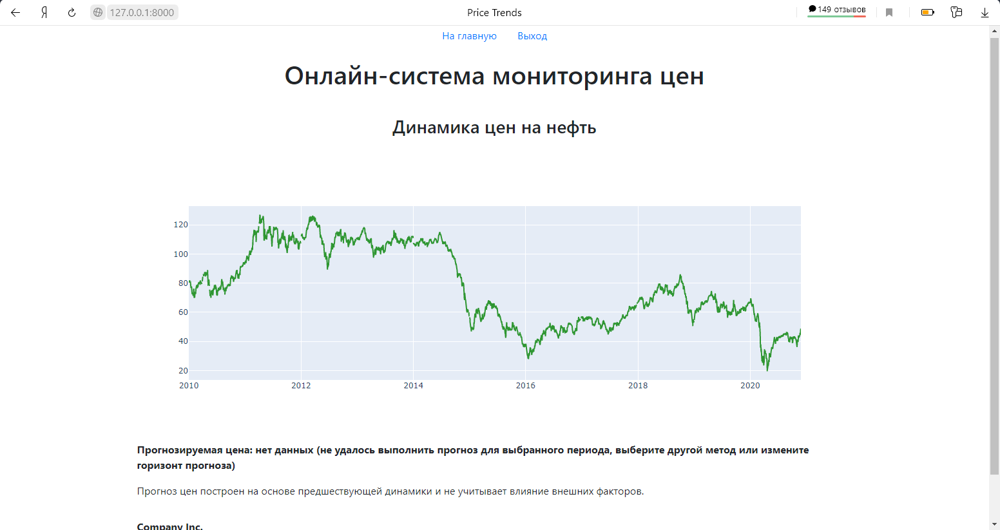

# Веб-приложение для доступа к базе данных по ценам

Приложение создано на основе **django** и позволяет зарегистрированным пользователям получать **онлайн-доступ** в личном кабинете к информации о **динамике и прогнозу цен на выбранные товары**. Для примера в данном случае взяты фактические данные о динамике цен на сырьевые товары (нефть марки Brent, золото и медь) с 2010 года.

Источник данных: выгрузка биржевых котировок с сайта https://www.finam.ru

Приложение легко может быть модифицировано для использования в любых отраслях, где имеются **большие объемы информации** о динамике каких-либо показателей, требующие для обработки значительных **вычислительных мощностей, которыми не располагают конечные пользователи**. Для обработки временных рядов и составления прогнозов могут быть подключены любые **модели машинного обучения или нейронные сети**.

##### Веб-интерфейс приложения

- **Главная страница:**

  - Для не вошедших в систему пользователей отображается общая информация с предложением ввести логин и пароль.

  - Для авторизовавшихся пользователей отображается инструкция и форма для выбора товарной категории (золото, медь, нефть), горизонта прогноза (1, 3, 6, 9 или 12 месяцев) и метода прогнозирования (линейная регрессия, экспоненциальное сглаживание).

- **Страница для регистрации пользователей.** Предназначена для ввода логина и пароля и не предусматривает возможности самостоятельной регистрации или смены пароля. В целях безопасности и ограничения несанкционированного доступа к информации регистрация пользователей производится только администратором сайта.

- **Страница с прогнозом:**

  - Для зарегистрированных пользователей отображаются графические материалы по выбранной товарной категории: интерактивный график с динамикой фактических цен и прогнозом, таблица с прогнозом цен с ежемесячной периодичностью. График реализован средствами библиотеки plotly, что позволяет пользователю изменять масштаб изображения и границы временного ряда, сохранять график в формате файла png. В текстовом формате отображается ожидаемая цена товара на конец прогнозного периода и ее изменение в процентах по отоношению к последним фактическим данным.

  - При попытке доступа к странице с прогнозом без предварительной авторизации отображается сообщение об ограничении доступа и предложение ввести логин и пароль.

##### Методы прогнозирования

- **Модель LinearRegression** из библиотеки **sklearn**. Выполняется несколько вариантов прогноза на основе предшествующего временного ряда протяженностью от 1/2 прогнозного периода до 4 прогнозных периодов. Выбирается прогноз с наиболее высоким коэффициентом детерминации (R2).
- **Модель ExponentialSmoothing** из библиотеки **statsmodels**. Для обучения модели используется временной ряд, равный по протяженности двум прогнозным периодам. В некоторых случаях при работе данной модели возникает ошибка "Optimization failed to converge". В этом случае для пользователя отображается только график с фактической динамикой цен в предшествующий период и сообщение о невозможности выполнить прогноз.

##### Обработка запросов к базе данных

Исходные данные после предварительной обработки были загружены в файл db.sqlite3. Каждая строка таблицы Price содержит дату и соответствующие цены по трем товарным категориям.

При заполнении пользователем формы выполняется запрос к базе данных: извлекаются все данные из столбца с датой и столбца с ценой выбранной категории. Полученный словарь преобразуется в pd.DataFrame и вместе с параметрами пользовательского ввода (метод прогноза, горизонт прогноза) передается в модель машинного обучения для выполнения прогноза.

Обработка запроса производится внутри функции в файле views.py приложения trends. Выполнение прогноза с заданными параметрами производится в модуле forecast.py приложения trends.

##### Авторизация пользователей и безопасность

Авторизация пользователей производится средствами django через стандартную форму. Приложение не предусматривает самостоятельную регистрацию пользователей. База пользователей, логины и пароли формируются только администратором сайта.

При выполнении запросов к базе данных пользователи выбирают варианты параметров из выпадающих списков. Текстовые поля для запросов в свободной форме не предусмотрены.

Обработка запросов из формы осуществляется через метод "GET". Чтобы предотвратить доступ к странице с данными со стороны не авторизованных пользователей в коде HTML предусмотрена проверка условия "if user.is_authenticated".

##### Варианты развития приложения

В текущей версии приложения выполнение прогноза осуществляется непосредственно в момент запроса пользователя к базе данных с учетом выбранных параметров, что приводит к относительно медленной загрузке страницы с прогнозом.

При работе с большими массивами данных может быть целесообразно производить однократное выполнение прогнозов по всем комбинациям входных параметров в момент обновления базы данных по ценам и сохранять полученные прогнозные значения в дополнительную таблицу.

В этом случае при заполнении пользователем формы на сайте будет выполняться запрос к двум таблицам базы данных, содержащим фактические ретроспективные значения и прогнозируемые значения. Модели машинного обучения в момент запроса пользователя задействованы не будут, что ускорит загрузку страницы.
